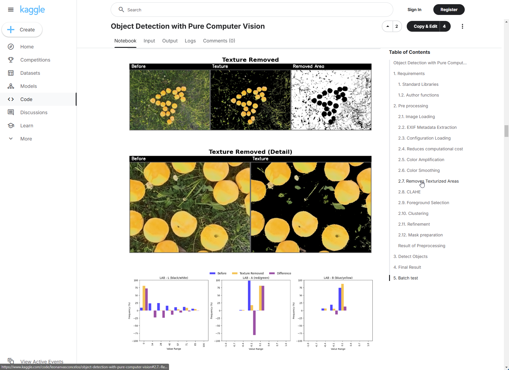

### Portfolio Table

| Project | Description | Screenshot |
|---|---|---|
| **[Object Detection with Pure Computer Vision Methods](https://www.kaggle.com/code/leonanvasconcelos/object-detection-with-pure-computer-vision)** | Implementation of computer vision techniques for object detection without using neural networks. |  |
| **[Coloring CCTV Images using a Custom CNN](https://www.kaggle.com/code/leonanvasconcelos/coloring-cctv-images-using-cnn)** | Utilizing a custom convolutional neural network (CNN) to colorize black-and-white CCTV images. |  |
| **[Image Feature Extractor](https://www.kaggle.com/code/leonanvasconcelos/image-feature-extractor)** | Extracting image features using advanced image processing techniques. |  |
| **[Ranking Image Similarity](https://www.kaggle.com/leonanvasconcelos/ranking-image-similarity)** | Developing a system to rank image similarity based on extracted features. |  |
| **[Image Tiling with Parallelization](https://www.kaggle.com/leonanvasconcelos/image-tiling-with-parallelization)** | Implementing parallelization techniques to optimize the tiling of large image datasets. |  |
| **[Web Photogrammetry Image Viewer](https://leonanucm.github.io/Photogrametry-Web-Viewer)** | Interactive web viewer for photogrammetry images, enabling 3D model visualization and analysis. |  |
